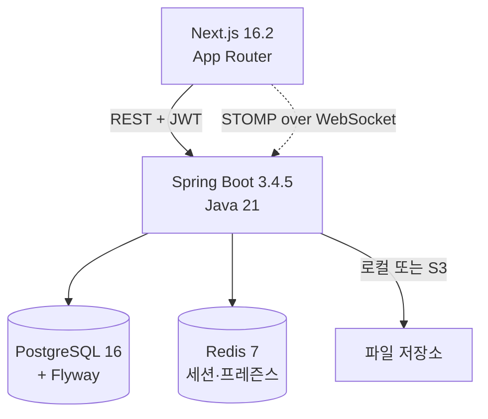

# Slack Clone

Slack을 모티브로 한 **실시간 협업 메신저 풀스택 클론**.
워크스페이스 / 채널 / DM / 스레드 / 파일 첨부 / 리액션 / 멘션 알림 / 프레즌스까지 포함한 포트폴리오 프로젝트.

<!-- TODO: docs/assets/landing.png 캡처 후 주석 해제 -->
<!--  -->

## ✨ 주요 기능

- 🔐 **JWT + Refresh Token** 인증 (쿠키 저장, Axios 자동 재발급)
- 🏢 **워크스페이스 / 채널** — 생성 · 초대 · 소프트 삭제
- 💬 **실시간 메시지** — STOMP 기반 채널 / DM / 스레드, 커서 페이지네이션
- 📎 **파일 첨부** — 로컬 업로드 + S3 Presigned URL (드래그&드롭)
- 👍 **이모지 리액션** — 동시성 방어 파셜 유니크 인덱스
- 🔔 **멘션 알림** — `@유저` 파싱 → 개인 큐 브로드캐스트 + 알림벨 드롭다운
- 🟢 **프레즌스** — Redis 기반 온라인 유저 Set, 실시간 ON/OFF 반영
- 🔗 **링크 프리뷰** — OG 메타 자동 추출

---

## 🛠 기술 스택

| 영역 | 기술 |
|---|---|
| Frontend | **Next.js 16.2.2** (App Router) · React 18 · TypeScript strict · Tailwind · shadcn/ui |
| 상태 관리 | **Zustand 4.5** (실시간 상태) · **TanStack Query 5.51** (서버 상태) |
| 실시간 | **STOMP over SockJS** (`@stomp/stompjs` 7.3 + `sockjs-client`) |
| Backend | **Spring Boot 3.4.5** · **Java 21** · Spring Security · JPA + **QueryDSL 5.1.0** |
| 보안 | JWT (jjwt 0.12.6) · BCrypt · isomorphic-dompurify · Refresh Token 회전 |
| 데이터베이스 | PostgreSQL 16 · Flyway 마이그레이션 (V1~V3) |
| 캐시 | Redis 7 — Refresh Token · Presence · Access Token 블랙리스트 |
| 파일 스토리지 | 로컬 업로드 + (선택) AWS S3 SDK v2 Presigned PUT URL |
| 인프라 | Docker · Docker Compose (4 서비스: postgres · redis · backend · frontend) |

---

## 🏗 아키텍처



더 자세한 시퀀스 다이어그램은 [docs/architecture.md](docs/architecture.md) 참고.

---

## 📁 디렉토리 구조

```
slack-clone/
├── backend/                      # Spring Boot 3.4.5
│   └── src/main/java/com/slackclone/
│       ├── auth/                 # 로그인·회원가입·토큰 갱신
│       ├── user/                 # 유저 프로필
│       ├── workspace/            # 워크스페이스 CRUD + 멤버
│       ├── channel/              # 채널 CRUD + 멤버
│       ├── message/              # 메시지 REST + @MessageMapping
│       ├── dm/                   # DM
│       ├── reaction/             # 리액션 (메시지/DM)
│       ├── file/                 # 업로드 (S3 + 로컬)
│       ├── notification/         # 멘션 알림
│       ├── presence/             # Redis 기반 온라인 상태
│       ├── og/                   # Open Graph 메타 프록시
│       ├── common/               # 예외·응답 래퍼·유틸
│       └── config/               # Security · WebSocket · Redis
│
├── frontend/                     # Next.js 16.2 App Router
│   ├── app/                      # 페이지 (auth, workspace/[id])
│   ├── components/
│   │   ├── chat/                 # ChatArea, ThreadPanel
│   │   ├── dm/                   # DmArea
│   │   ├── sidebar/              # 워크스페이스/채널 사이드바
│   │   └── notification/         # 알림벨
│   ├── hooks/                    # useChannelWebSocket, useDmWebSocket, ...
│   ├── lib/                      # api.ts (Axios + refresh 인터셉터), markdown.ts
│   ├── store/                    # Zustand (auth, chat, dm, notification)
│   └── types/
│
├── docs/                         # 📚 프로젝트 문서
│   ├── api.md                    # API 레퍼런스
│   ├── architecture.md           # 시스템/시퀀스 다이어그램
│   ├── erd.md                    # DB ERD + 제약
│   ├── portfolio.md              # 포트폴리오 1페이지 (한국어)
│   └── portfolio.en.md           # English portfolio
│
├── .env.example
├── docker-compose.yml
└── README.md
```

---

## 🚀 빠른 시작

### 사전 요구사항

| 도구 | 버전 |
|---|---|
| Docker | 24+ |
| Docker Compose | v2+ |
| (로컬 개발) Node.js | 18+ |
| (로컬 개발) Java | 21+ |

### Docker Compose로 전체 실행 (권장)

```bash
git clone https://github.com/your-username/slack-clone.git
cd slack-clone
cp .env.example .env
# .env 파일을 열어 DB 패스워드, JWT 시크릿 등을 설정

docker-compose up --build -d
docker-compose logs -f
```

| 서비스 | URL |
|---|---|
| Frontend | http://localhost:3000 |
| Backend API | http://localhost:8080 |
| PostgreSQL | localhost:5432 |
| Redis | localhost:6379 |

### 로컬 개발 (핫 리로드)

```bash
# 1) 인프라만 Docker로
docker-compose up postgres redis -d

# 2) 백엔드
cd backend
./gradlew bootRun

# 3) 프론트엔드
cd frontend
cp .env.example .env.local
npm install
npm run dev
```

---

## 🔑 환경변수

| 변수 | 설명 |
|---|---|
| `POSTGRES_DB` / `POSTGRES_USER` / `POSTGRES_PASSWORD` | DB 접속 정보 |
| `REDIS_PASSWORD` | Redis 인증 (비워두면 비인증, 개발용만) |
| `JWT_SECRET` | JWT 서명 키 (256비트 이상 랜덤 문자열) |
| `JWT_EXPIRATION` | Access Token 만료 (ms, 기본 900000 = 15분) |
| `JWT_REFRESH_EXPIRATION` | Refresh Token 만료 (기본 604800000 = 7일) |
| `AWS_ACCESS_KEY` / `AWS_SECRET_KEY` / `S3_BUCKET_NAME` | S3 업로드 사용 시만 |
| `NEXT_PUBLIC_API_URL` | 프론트 → 백엔드 REST |
| `NEXT_PUBLIC_SOCKET_URL` | 프론트 → 백엔드 WebSocket |

> 로컬 업로드만 사용하면 AWS 관련 변수는 비워둬도 됩니다 (`/api/files/upload/local` 엔드포인트 사용).

---

## 📜 주요 스크립트

| 명령 | 설명 |
|---|---|
| `npm run dev` | 프론트 개발 서버 (Next.js turbopack) |
| `npm run build` | 프론트 프로덕션 빌드 |
| `./gradlew bootRun` | 백엔드 개발 서버 |
| `./gradlew build` | 백엔드 테스트 + JAR 빌드 |
| `./gradlew test` | 백엔드 테스트만 |
| `docker-compose up -d` | 전체 스택 실행 |

---

## 📚 문서

- [API 레퍼런스](docs/api.md)
- [아키텍처 & 시퀀스](docs/architecture.md)
- [ERD & DB 제약](docs/erd.md)
- [포트폴리오 요약 (한국어)](docs/portfolio.md)
- [Portfolio (English)](docs/portfolio.en.md)
- [코딩 컨벤션](CLAUDE.md)

---

## 🌿 브랜치 전략

```
main        ← 프로덕션 (PR 머지만 허용)
 └─ develop ← 통합 개발
     ├─ feat/*       신규 기능
     ├─ fix/*        버그 수정
     ├─ refactor/*   리팩터링 (기능 변경 없음)
     ├─ chore/*      빌드·설정·의존성
     └─ docs/*       문서
```

커밋 메시지는 [Conventional Commits](https://www.conventionalcommits.org/) 형식.

---

## 📄 라이선스

MIT
