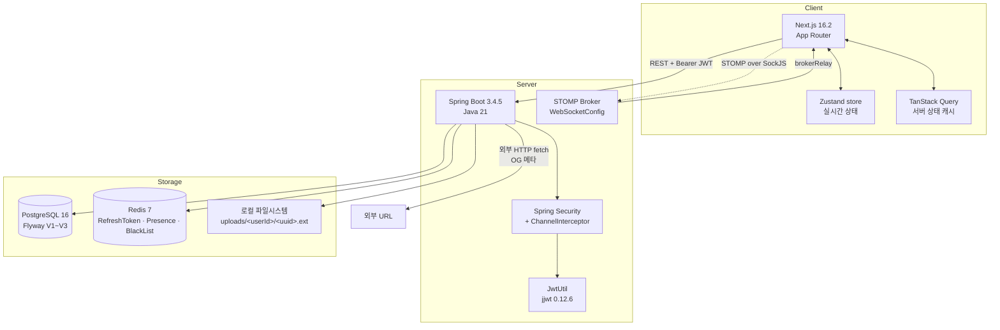
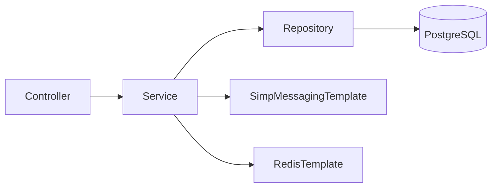
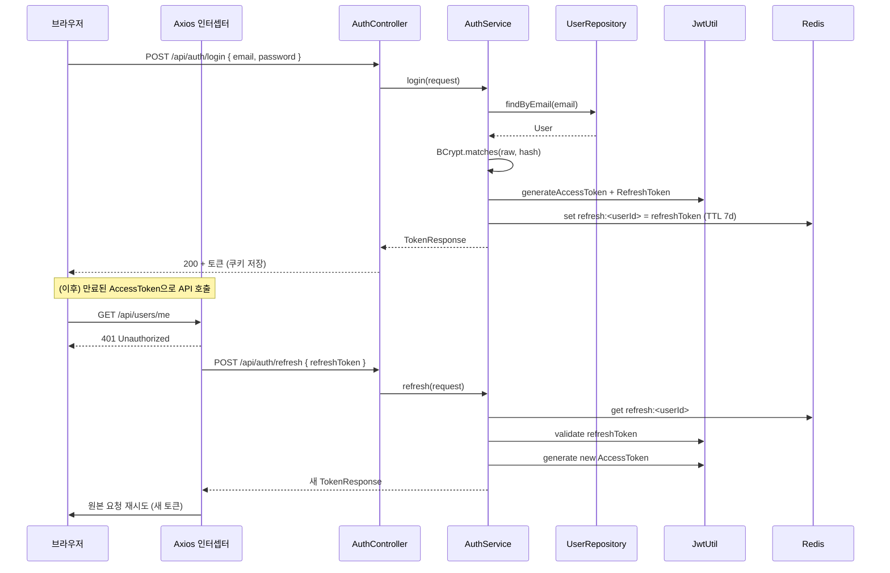
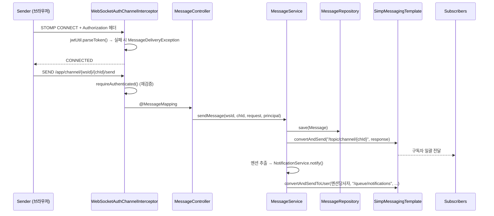
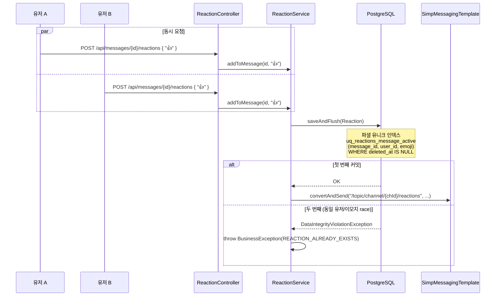
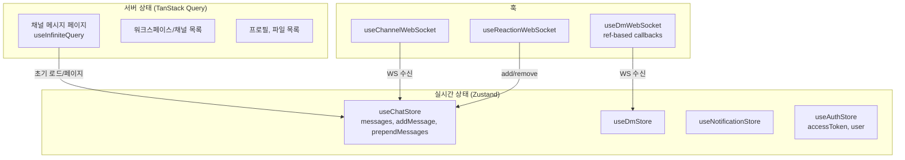
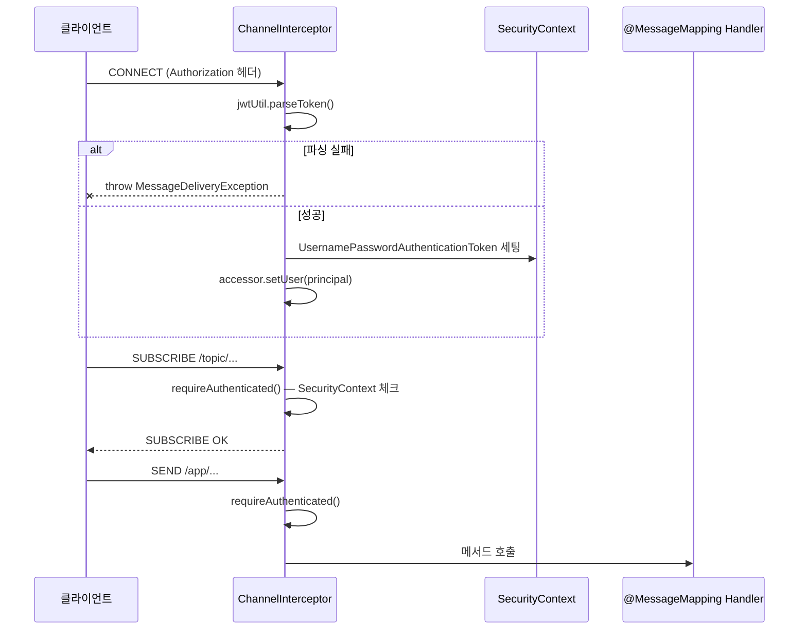

# 시스템 아키텍처

## 전체 구성도



## 백엔드 패키지 구조 (도메인별)



도메인 폴더:
- `auth` · `user` · `workspace` · `channel` · `message` · `dm` · `reaction`
- `file` · `notification` · `presence` · `og`
- `common` (예외, 응답 래퍼, 유틸) · `config` (WebSocket, Security, Redis)

각 도메인 내부:
```
<domain>/
├── controller/     REST 엔드포인트 / STOMP @MessageMapping
├── service/        트랜잭션 + 비즈니스 로직
├── repository/     JpaRepository + QueryDSL
├── dto/            Request / Response (Java record 우선)
└── entity/         JPA @Entity (soft delete 필드 공통)
```

---

## 시퀀스: 로그인 + Refresh 흐름



**실패 경로**: Refresh도 만료/조작 시 `forceLogout()` — Zustand clearAuth + 쿠키 삭제 + `/`로 리다이렉트 (stale UI 방지).

---

## 시퀀스: 채널 메시지 전송 (WebSocket)



**클라이언트 머지 정책** (`ChatArea.tsx`):
- 첫 페이지 로드 → `setMessages(chId, pages[0])` + 스크롤 하단
- 추가 페이지(과거) → `prependMessages(chId, diff)` + 스크롤 위치 유지
- WS 수신 → `addMessage(chId, msg)` (페이지네이션과 독립)
- `processedPagesRef`로 이미 머지한 페이지 수 추적 → 중복 머지/덮어쓰기 방지

---

## 시퀀스: 리액션 추가 (동시성 방어)



DB 제약이 진실의 원천 — 서비스 레이어는 변환만 담당.

---

## 프론트엔드 상태 관리 레이어



**설계 원칙**: 서버에서 받아오는 불변 스냅샷은 TQ 캐시, 실시간으로 변하는 현재 뷰 상태는 Zustand. `useEffect`에서 store를 통째로 치환하면 WS 수신이 사라지므로, 병합 정책을 명시적으로 작성.

---

## WebSocket 보안 계층



HTTP 필터 체인을 거치지 않으므로 STOMP 단에서 **전 커맨드별 가드**가 필수.
