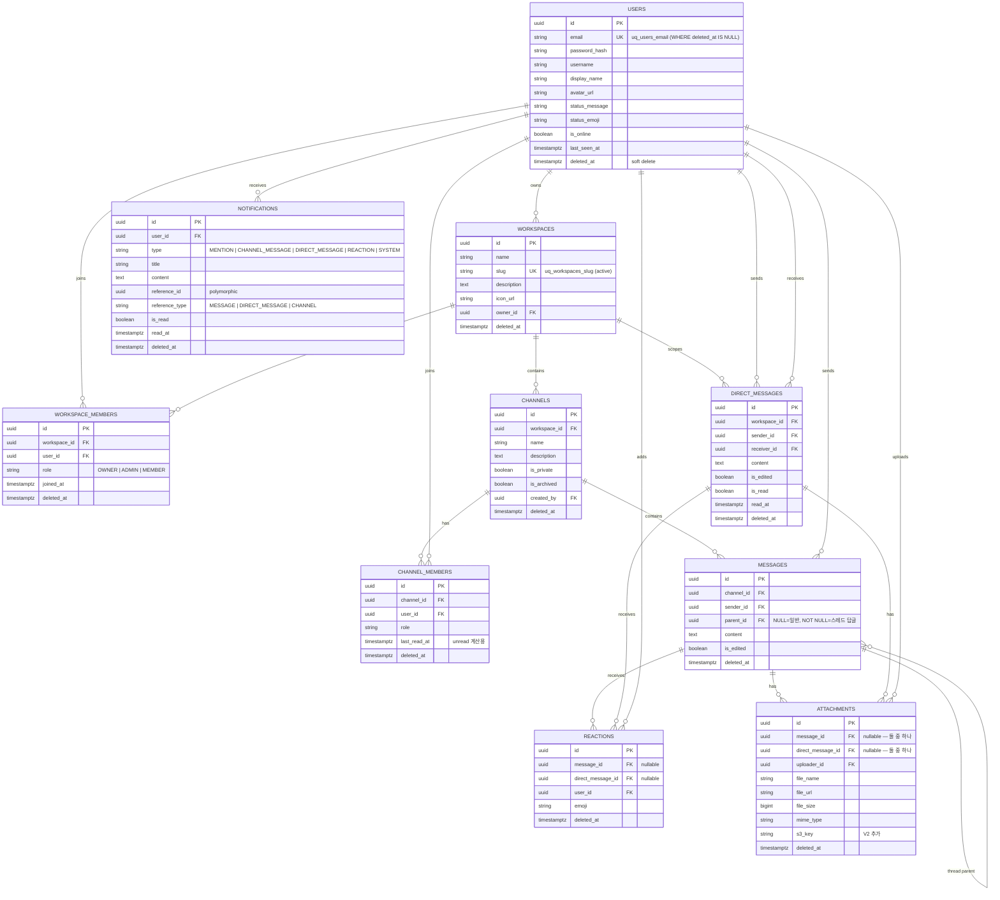

# ERD — 데이터 모델

> Flyway `V1__init.sql` / `V2__attachment_s3_support.sql` / `V3__relax_attachment_constraint.sql` 기반.

## 엔티티 관계도



## 핵심 제약 (constraints)

### 소프트 삭제 + 유니크의 동시 보장

전 테이블 공통: `deleted_at TIMESTAMPTZ` 컬럼 + **파셜 유니크 인덱스** 조합.

```sql
-- 이메일 — 삭제된 유저는 같은 이메일 재등록 허용, 활성 유저는 유일
CREATE UNIQUE INDEX uq_users_email
    ON USERS (email) WHERE deleted_at IS NULL;

-- 워크스페이스 멤버십 중복 방지 (나갔다 들어오기 가능)
CREATE UNIQUE INDEX uq_workspace_members_active
    ON WORKSPACE_MEMBERS (workspace_id, user_id) WHERE deleted_at IS NULL;

-- 채널 멤버십
CREATE UNIQUE INDEX uq_channel_members_active
    ON CHANNEL_MEMBERS (channel_id, user_id) WHERE deleted_at IS NULL;

-- 리액션: 같은 유저가 같은 이모지 두 번 누르기 방지
CREATE UNIQUE INDEX uq_reactions_message_active
    ON REACTIONS (message_id, user_id, emoji)
    WHERE message_id IS NOT NULL AND deleted_at IS NULL;

CREATE UNIQUE INDEX uq_reactions_dm_active
    ON REACTIONS (direct_message_id, user_id, emoji)
    WHERE direct_message_id IS NOT NULL AND deleted_at IS NULL;
```

동시 요청으로 두 트랜잭션이 같은 `(message, user, emoji)`를 insert하면 **DB가 두 번째만 거부**. 서비스 레이어는 `DataIntegrityViolationException`을 `REACTION_ALREADY_EXISTS`로 변환.

### Polymorphic FK (attachment / reaction)

`ATTACHMENTS`와 `REACTIONS`는 **메시지(채널) 또는 DM 둘 중 하나**에 달린다.

`V1` 제약:
```sql
CHECK (
  (message_id IS NOT NULL AND direct_message_id IS NULL) OR
  (message_id IS NULL AND direct_message_id IS NOT NULL)
)
```

`V3` 완화 (S3 presigned 방식 지원 — 업로드 시점엔 아직 메시지 미생성):
```sql
CHECK (NOT (message_id IS NOT NULL AND direct_message_id IS NOT NULL))
-- 둘 다 NOT NULL만 금지, 둘 다 NULL은 허용 (pending 상태)
```

## 인덱스 전략

| 인덱스 | 대상 | 용도 |
|---|---|---|
| `idx_messages_channel_id` | `MESSAGES(channel_id)` | 채널 메시지 페이지네이션 |
| `idx_messages_parent_id` | `MESSAGES(parent_id)` | 스레드 답글 조회 |
| `idx_direct_messages_workspace_id` | `DIRECT_MESSAGES` | 워크스페이스별 DM |
| `idx_notifications_user_unread` | `NOTIFICATIONS(user_id, is_read) WHERE is_read = FALSE` | **안읽은 알림 부분 인덱스** — 테이블 커져도 unread count 빠름 |
| `idx_channel_members_user_id` | `CHANNEL_MEMBERS(user_id)` | 내가 속한 채널 목록 |

## 커서 페이지네이션 (Messages / DM)

정렬: `created_at DESC, id DESC`.

```sql
SELECT * FROM MESSAGES
WHERE channel_id = :cid
  AND deleted_at IS NULL
  AND (created_at, id) < (:cursorTs, :cursorId)
ORDER BY created_at DESC, id DESC
LIMIT 30;
```

응답 DTO: `{ messages: [...], nextCursor: "TS_ID_encoded", hasMore: boolean }`.

## 마이그레이션 이력

| 버전 | 파일 | 내용 |
|---|---|---|
| V1 | `V1__init.sql` | 전체 스키마 (11 테이블 + 파셜 유니크 + FK + 기본 인덱스) |
| V2 | `V2__attachment_s3_support.sql` | `ATTACHMENTS.s3_key` 컬럼 + 기존 CHECK 제거 (pending 허용) |
| V3 | `V3__relax_attachment_constraint.sql` | `chk_attachments_target` 재정의 — 둘 다 NOT NULL만 금지 |
