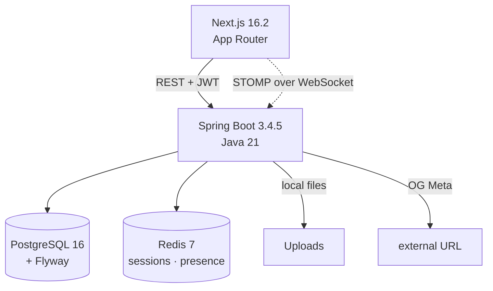

# Slack Clone — Real-time Team Messenger

> A **full-stack real-time collaboration messenger** inspired by Slack. Includes workspaces / channels / DMs / threads / file attachments / reactions / mention notifications / presence.

**Duration**: 2026-04-07 ~ 2026-04-17 (11 days, 16 commits)  |  **Role**: Full-stack solo developer  |  **Scale**: 97 Java files · 35 TSX files · +33K / -2.8K LoC

---

## 🎯 Project Goal

Started to go beyond simple CRUD and hands-on with the **complexities of real-time messaging (concurrency · state synchronization · authenticated WebSocket)**. The objective was to address real-world issues that arise when Spring Boot STOMP meets React real-time state management — at the design stage, not as afterthought patches.

---

## 🏗 Architecture

### Three key technical decisions

1. **Soft delete + uniqueness, together** — PostgreSQL **partial unique indexes** with `WHERE deleted_at IS NULL`. For reactions / memberships where "duplicates allowed when deleted, unique when active" is the rule, this is **enforced at the DB layer instead of application code**. A root-cause defense against concurrency bugs.
2. **STOMP topic segmentation** — Chose STOMP over raw WebSocket for **subscription-level routing**. Topics split by domain: `/topic/channel/{id}`, `/topic/dm/{wsId}/{pair}`, `/topic/channel/{id}/reactions`, `/topic/workspace/{id}/presence`. Clients subscribe only to the streams they need → bandwidth & render cost savings.
3. **Server state vs real-time state separation** — Pagination loads (API) go through **TanStack Query**, WebSocket-received messages go to a **Zustand store**. Mixing the two caused a bug where infinite-scroll loads overwrote incoming live messages (observed as C-008). Solved with a **`processedPagesRef`-based merge strategy** that only prepends new pages.

### Tech stack

| Layer | Stack |
|---|---|
| Backend | Spring Boot 3.4.5 · Java 21 · Spring Security · JPA + **QueryDSL 5.1** · Flyway |
| Frontend | Next.js 16.2 (App Router) · React 18 · **TanStack Query** · **Zustand** · react-hook-form + **zod** · Tailwind + Radix/shadcn · isomorphic-dompurify |
| Real-time | **STOMP over WebSocket** (@stomp/stompjs · SockJS) |
| Auth | **JWT + Refresh Token** (jjwt 0.12.6, cookie-stored, auto-refresh interceptor) |
| Infra | Docker Compose (PG · Redis · BE · FE, 4 services) |

---

## 💡 Troubleshooting Highlights

### 1. WebSocket STOMP authentication bypass — **Security**
- **Context**: `WebSocketAuthChannelInterceptor` swallowed JWT parsing exceptions in an empty catch during the CONNECT phase, and lacked auth re-validation on SEND/SUBSCRIBE. The result: **channel messages could be sent/subscribed with no token or a forged one**.
- **Root cause**: When `jwtUtil.parseToken()` threw, the code still fell through to `accessor.setUser()` and downstream handlers — a classic fall-through bug.
- **Fix**: (1) throw `MessageDeliveryException` immediately on parse failure, (2) add a `requireAuthenticated()` guard on both SEND and SUBSCRIBE commands, (3) explicitly set a `UsernamePasswordAuthenticationToken` on CONNECT so SecurityContext stays in sync.
- **Takeaway**: STOMP doesn't go through the HTTP filter chain, so **per-command auth gating must be designed inside the `ChannelInterceptor`**. Relying on Spring Security's defaults leaves the socket wide open.

### 2. Infinite scroll vs WebSocket state sync — **Architecture**
- **Context**: Scrolling up in a channel to load older messages made **newly-received live messages disappear**, and the viewport jumped to the bottom.
- **Root cause**: A `useEffect` was dumping `data.pages.flatMap(...)` into the Zustand store on every render, **overwriting** the store — and the same effect unconditionally called `scrollToBottom()`. Every older-page load wiped the WS-added messages and reset the viewport.
- **Fix**: A `processedPagesRef` tracks how many pages have been merged. **First page** → `setMessages` + scroll to bottom. **Subsequent pages** → diff-only `prependMessages`, preserve scroll position. WS messages (`addMessage`) accumulate independently.
- **Takeaway**: Paginated server state and live-pushed state must have an **explicit merge policy**. Blindly replacing the store inside `useEffect` is almost always a bug waiting to happen.

### 3. XSS + Path Traversal — dual defense — **Security**
- **Context**: Message bodies were rendered via `dangerouslySetInnerHTML` (a lightweight markdown parser), and the local file-serving API concatenated a `fileName` param directly into a filesystem path.
- **Root causes**: (XSS) the `href="${escaped}"` wasn't escaping quotes (`"`, `'`), enabling `onclick` injection. (Path Traversal) `Paths.get(uploadDir, userId, fileName)` accepted `..` input and escaped the upload root.
- **Fix**:
  - XSS: consolidated `lib/markdown.ts`. Configured `isomorphic-dompurify` with `ALLOWED_URI_REGEXP: /^https?:\/\//` to block the `javascript:` scheme at source, an extended escaper that covers quotes, and a strict whitelist (`<em>`, `<strong>`, `<code>`, `<a>` only). Merged duplicate `renderMarkdown` implementations in ChatArea / DmArea / ThreadPanel into a single function.
  - Path Traversal: force-parse `userId` with `UUID.fromString`, reject `..` / slashes in `fileName`, and `Path.normalize()` + `startsWith(baseDir)` enforcement **denies any access outside the boundary**.
- **Takeaway**: "Building HTML on the frontend means auditing every input path." File-serving endpoints need **whitelist + normalization + boundary check** as standard three-layer defense.

---

## 📦 Implemented Domains

`auth` · `workspace` · `channel` · `message` (+ Thread) · `dm` · `reaction` · `file` (upload/serve) · `notification` (mention/bell) · `presence` (online state) · `og` (link preview) · `user`

Real-time streams: **channel messages / DM / reaction add·remove / presence / notifications** — 5 in total.

---

## 🔐 Quality · Security

- **Senior review pass**: Ran a self-built `senior-review-agent` which surfaced Critical 8 / High 7 / Medium 7 / Low 3 issues → fixed all 8 Critical items + passed an auto re-review.
- **Global exception handling**: `BusinessException` + `ErrorCode` enum + `GlobalExceptionHandler` unify the error response format (`ApiResponse<T>`).
- **Token safety**: On refresh failure, flush the in-flight token queue, delete cookies, and redirect home — preventing stale-session UI.

---

## 🔗 Links

- **Repository**: `C:\Users\USER\Desktop\포트폴리오\slack-clone` (local)
- **Docs**: [README](../README.md) · [API](api.md) · [Architecture](architecture.md) · [ERD](erd.md)

<!-- TODO: screenshots / demo GIFs / deployment URL -->
