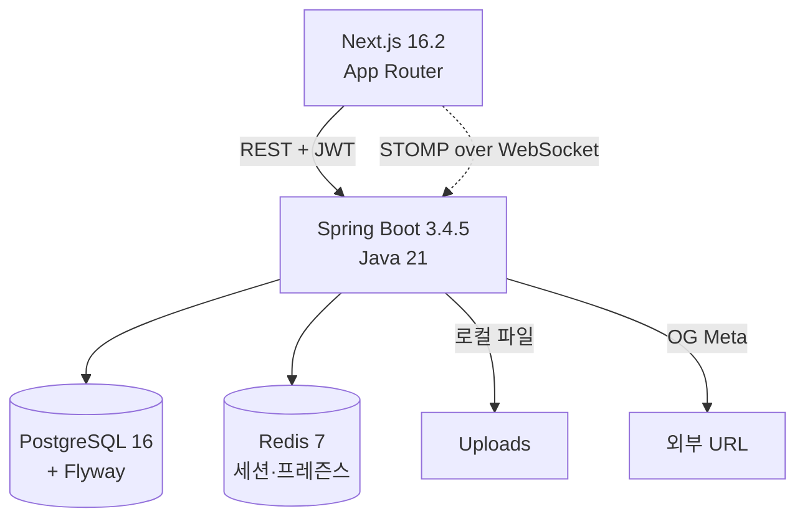

# Slack Clone — 실시간 팀 메신저

> Slack을 모티브로 한 **실시간 협업 메신저 풀스택 클론**. 워크스페이스 / 채널 / DM / 스레드 / 파일 첨부 / 리액션 / 멘션 알림 / 프레즌스까지 포함.

**기간**: 2026-04-07 ~ 2026-04-17 (11일, 16커밋)  |  **역할**: Full-stack 1인 개발  |  **규모**: Java 97파일 · TSX 35파일 · +33K / -2.8K LoC

---

## 🎯 프로젝트 목표

단순한 CRUD를 넘어 **실시간 메시징의 복잡도(동시성 · 상태 동기화 · 인증된 WebSocket)** 를 직접 다뤄보기 위해 시작. Spring Boot STOMP와 React 실시간 상태관리가 결합될 때 발생하는 실전 이슈를 설계 단계부터 해소하는 것이 목표.

---

## 🏗 아키텍처

### 핵심 기술 결정 3가지

1. **소프트 삭제 + 고유 제약을 동시에** — PostgreSQL **파셜 유니크 인덱스** `WHERE deleted_at IS NULL` 적용. 리액션/멤버십처럼 "삭제된 것은 중복 허용, 활성만 유니크" 요건을 애플리케이션 레벨이 아닌 **DB 레벨에서 보장**. 동시성 버그의 근본 방어.
2. **STOMP 토픽 분리 설계** — 순수 WebSocket 대신 STOMP 선택 이유는 **구독 단위 라우팅**. `/topic/channel/{id}`, `/topic/dm/{wsId}/{pair}`, `/topic/channel/{id}/reactions`, `/topic/workspace/{id}/presence` 식으로 토픽을 도메인별로 쪼개 클라이언트가 필요한 스트림만 구독 → 대역폭·렌더 비용 절감.
3. **서버 상태 vs 실시간 상태 분리** — 페이징 로드(API)는 **TanStack Query**, WebSocket 수신 메시지는 **Zustand store**. 두 레이어를 섞으면 무한스크롤 시 실시간 수신 메시지가 덮어써지는 버그 발생(실제 C-008으로 경험) → 현재는 **`processedPagesRef`로 신규 페이지만 prepend**하는 병합 전략으로 해결.

### 기술 스택

| 영역 | 스택 |
|---|---|
| Backend | Spring Boot 3.4.5 · Java 21 · Spring Security · JPA + **QueryDSL 5.1** · Flyway |
| Frontend | Next.js 16.2 (App Router) · React 18 · **TanStack Query** · **Zustand** · react-hook-form + **zod** · Tailwind + Radix/shadcn · isomorphic-dompurify |
| 실시간 | **STOMP over WebSocket** (@stomp/stompjs · SockJS) |
| 인증 | **JWT + Refresh Token** (jjwt 0.12.6, 쿠키 저장, 자동 재발급 인터셉터) |
| 인프라 | Docker Compose (PG · Redis · BE · FE 4 서비스) |

---

## 💡 트러블슈팅 하이라이트

### 1. WebSocket STOMP 인증 우회 취약점 — **보안**
- **상황**: `WebSocketAuthChannelInterceptor`의 CONNECT 단계에서 JWT 파싱 예외를 빈 catch로 삼키고 있었고, SEND/SUBSCRIBE 단계 인증 재검증이 누락. 결과적으로 **토큰 없이 또는 조작된 토큰으로 채널 메시지를 전송/구독 가능**.
- **원인**: `jwtUtil.parseToken()` 실패 시에도 `accessor.setUser()` 이후 로직이 실행되는 fall-through 구조.
- **해결**: (1) 파싱 실패 시 `MessageDeliveryException` 즉시 throw, (2) SEND / SUBSCRIBE 커맨드에 `requireAuthenticated()` 가드 추가, (3) CONNECT에서 `UsernamePasswordAuthenticationToken`을 명시적으로 세팅해 SecurityContext 연동.
- **배운 점**: STOMP는 HTTP 필터 체인을 거치지 않으므로 `ChannelInterceptor`에서 **전 커맨드 단계별 인증**을 직접 설계해야 함. Spring Security 기본값에 의존하면 뚫림.

### 2. 무한스크롤과 WebSocket 메시지의 상태 동기화 — **아키텍처**
- **상황**: 채널에서 위로 스크롤해 과거 메시지를 로드하면 **실시간 수신된 신규 메시지가 사라지고**, 스크롤도 자동으로 최하단으로 튀는 버그.
- **원인**: `useEffect`에서 `data.pages.flatMap(...)` 을 Zustand 스토어에 **매번 덮어쓰기** 하고, 같은 effect에서 `scrollToBottom()`이 무조건 호출. 과거 페이지가 로드될 때마다 WS로 추가된 최신 메시지가 지워지고 뷰포트가 리셋됨.
- **해결**: `processedPagesRef`로 이미 머지한 페이지 수를 추적 → **첫 페이지**는 `setMessages` + 스크롤 하단, **추가 페이지**는 차이분만 `prependMessages`로 머지하고 **스크롤 위치 유지**. WS 수신 메시지(`addMessage`)는 이와 독립적으로 누적.
- **배운 점**: 서버 페이지네이션 상태와 실시간 푸시 상태는 **병합 정책을 명시적으로 설계**해야 하고, `useEffect`에서 store를 통째로 치환하는 패턴은 거의 항상 버그의 씨앗.

### 3. XSS + Path Traversal 동시 방어 — **보안**
- **상황**: 메시지 본문을 `dangerouslySetInnerHTML`로 렌더(마크다운 간이 파서) + 로컬 파일 서빙 API가 `fileName` 파라미터를 직접 경로에 결합.
- **원인**: (XSS) `href="${escaped}"`에서 따옴표(`"`, `'`) 이스케이프 누락 → `onclick` 주입 가능. (Path Traversal) `Paths.get(uploadDir, userId, fileName)`에 `..` 포함 입력 시 업로드 루트를 벗어남.
- **해결**:
  - XSS: 공용 `lib/markdown.ts` 생성 → `isomorphic-dompurify`의 `ALLOWED_URI_REGEXP: /^https?:\/\//` 로 `javascript:` 스킴 원천 차단, 따옴표까지 이스케이프하는 확장 escaper 적용, `<em>`/`<strong>`/`<code>`/`<a>`만 화이트리스트로 허용. 3개 컴포넌트(ChatArea · DmArea · ThreadPanel)의 중복 `renderMarkdown`을 단일 구현으로 통합.
  - Path Traversal: `UUID.fromString(userId)`로 userId 포맷 강제, `fileName`에 `..` / 슬래시 차단, `Path.normalize()` 후 `startsWith(baseDir)`로 **경계 바깥 접근 거절**.
- **배운 점**: "프론트에서 직접 HTML을 만드는 순간 모든 입력 경로를 재검토"해야 하고, 파일 서빙 경로는 **화이트리스트+정규화+경계검사** 3중 방어가 기본.

---

## 📦 구현 도메인 범위

`auth` · `workspace` · `channel` · `message`(+ Thread) · `dm` · `reaction` · `file`(업로드/서빙) · `notification`(멘션/알림벨) · `presence`(온라인 상태) · `og`(링크 프리뷰) · `user`

실시간 스트림: **채널 메시지 / DM / 리액션 add·remove / 프레즌스 / 알림** 총 5종.

---

## 🔐 품질 · 보안

- **시니어 리뷰 세션**: 자체 제작 `senior-review-agent`로 Critical 8 / High 7 / Medium 7 / Low 3 이슈 1차 진단 → Critical 8건 전량 수정 + 자동 재검토 통과.
- **전역 예외 처리**: `BusinessException` + `ErrorCode` enum + `GlobalExceptionHandler`로 에러 응답 포맷 통일 (`ApiResponse<T>`).
- **토큰 안전성**: Refresh 실패 시 토큰 큐 flush + 쿠키 즉시 삭제 + 홈 리다이렉트 (stale 세션 UI 방지).

---

## 🔗 링크

- **저장소**: `C:\Users\USER\Desktop\포트폴리오\slack-clone` (로컬)
- **상세 문서**: [README](../README.md) · [CLAUDE.md](../CLAUDE.md) (개발 컨벤션)

<!-- TODO: 스크린샷 / 데모 GIF / 배포 URL 추가 -->
